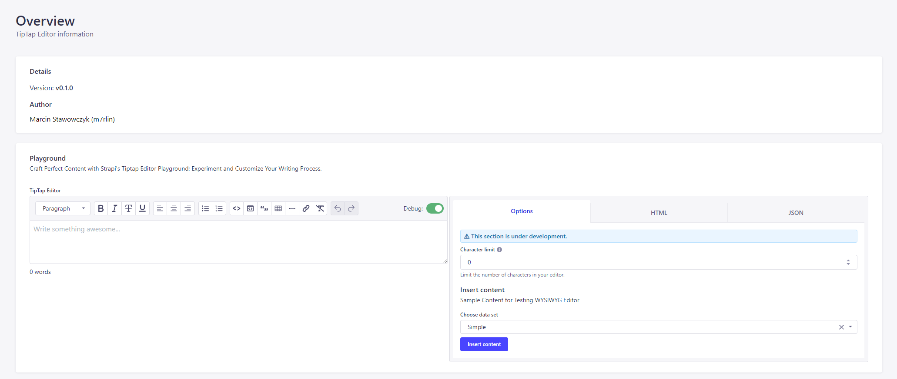

<p align="center">
  <a href="https://magictm.com" target="_blank" rel="noopener noreferrer">
    
  </a>
</p>
<br/>

<p align="center">
<a href='#'>
</a>
<a href="https://www.npmjs.com/package/@magictm/strapi-plugin-tiptap-editor" target="__blank"></a>
<a href="https://www.npmjs.com/package/@magictm/strapi-plugin-tiptap-editor" target="__blank"></a>
<a href="https://github.com/magictm/strapi-plugin-tiptap-editor" target="__blank"></a>
</p>

<br/>

<h1 align='left'>MagicTM · Tiptap Editor · Strapi Plugin</h1>

🎨 The MagicTM Tiptap Editor Strapi Plugin is a customizable WYSIWYG editor which replaces Strapi's default editor. It provides a beautiful and intuitive editing experience for your content creators. It is only available for Strapi v4.



🌐 Follow me: https://stawowczyk.me

> 🚨 Note: This plugin is in alpha stage and should not be used in production.

## ⛓ Versions

Strapi v4 - (current) - v0.x

## 💻 Install

### 1. Install the plugin

To install the MagicTM Tiptap Editor Strapi Plugin, you can simply run the following command:

```sh
npm install @magictm/strapi-plugin-tiptap-editor
```

### 2. Enable the plugin

<!-- enable the plugin in the admin panel -->

Goto `<strapi app root>/config/plugins.js` Add the following code snippet.

```js
module.exports = ({ env }) => ({
    // ...
    'tiptap-editor': {
        enabled: true,
    },
})
```

### 3. Build and start the Admin UI

Afterwards, you would need to build a fresh strapi admin panel includes the MagicTM Tiptap Editor plugin. For it, please execute the commands below:

<!-- Build the admin UI -->

```bash
npm run build
npm run develop
```

The MagicTM Tiptap Editor plugin should appear in the Plugins section of the Strapi sidebar after you run the app again.

Now you are ready to integrate Tiptap WYSIWYG editor on your Strapi website 🎉
<br/><br/>

## ⚙️ Configuration

The MagicTM Tiptap Editor Strapi Plugin is fully customizable. To configure the plugin, you can:

-   Set default options in the plugin's config/settings.js file
-   Create custom extensions for the editor
-   Use content templates to provide fast and consistent content creation

## 📋 TODO:

-   [ ] Config settings
-   [ ] Settings page for customization
-   [ ] More extensions
-   [ ] Custom extensions
-   [ ] Content templates for faster usage

## 🤝 Contributing

Contributions to the MagicTM Tiptap Editor Strapi Plugin are always welcome! To contribute:

-   Fork the repository
-   Create a new branch for your changes
-   Make your changes and commit them
-   Push your changes to your forked repository
-   Submit a pull request

## ☕️ Help me keep working on this project 💚

If you find this plugin helpful, please consider supporting my work by buying me a coffee ☕️ at https://www.buymeacoffee.com/m7rlin or via PayPal at https://paypal.me/merlinArtist.

## 🎖️ Sponsors

### Special Sponsors

Your company here

### Gold Sponsors

Your company here

### Sponsors

Your company here

Your company here

### Past Sponsors

Your company here

Your company here

## 📜 License

LGPL-2.1 License © 2023-PRESENT Marcin Stawowczyk (m7rlin)

<hr>

Thank you for using the MagicTM Tiptap Editor Strapi Plugin!
